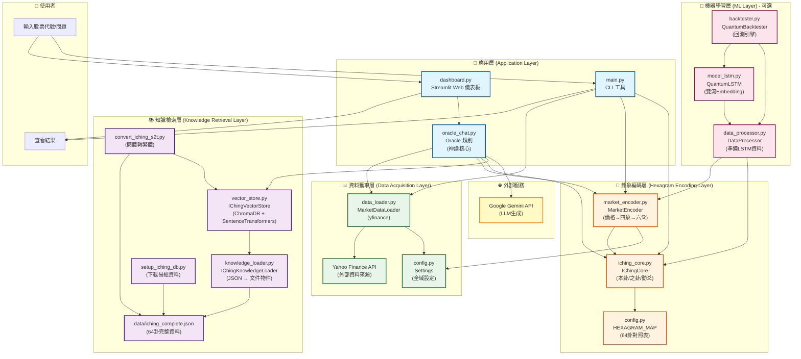
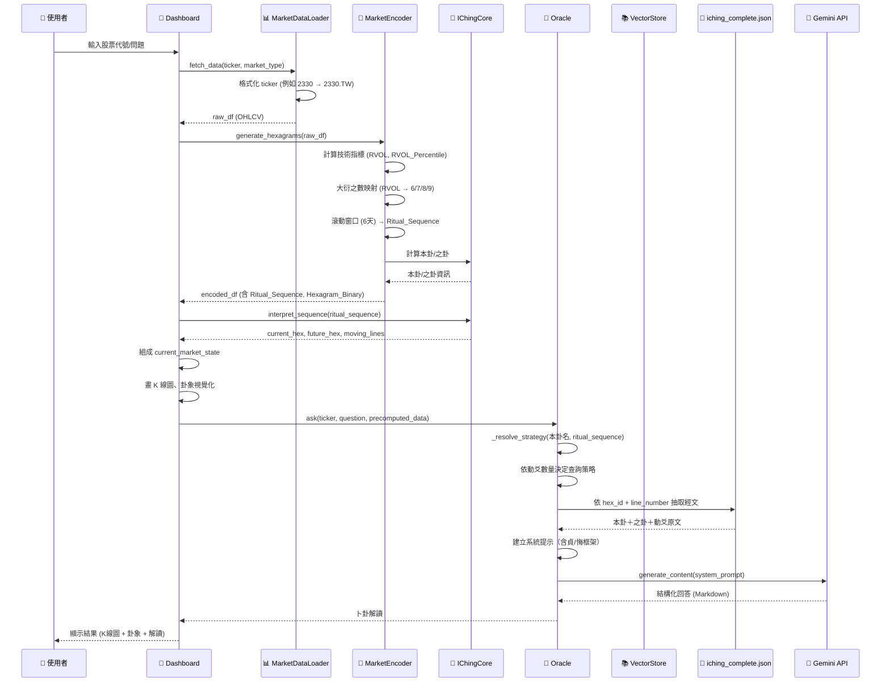

# Quantum I-Ching 系統架構文件

本文檔詳細說明 Quantum I-Ching 股市卜卦系統的完整架構，包含各層次的功能說明與資料流程。

---

## 系統架構總覽

本系統採用**四層架構**設計，從資料獲取到最終的AI解讀，完整實現了易經智慧與現代金融分析的結合。

```
┌─────────────────────────────────────────────────────────────────┐
│                        應用層 (Application Layer)                │
│  ┌──────────────────┐  ┌──────────────────┐  ┌──────────────┐ │
│  │  Streamlit       │  │  Oracle          │  │  CLI         │ │
│  │  Dashboard       │  │  (神諭核心)      │  │  (main.py)   │ │
│  └──────────────────┘  └──────────────────┘  └──────────────┘ │
└─────────────────────────────────────────────────────────────────┘
                              ↓ ↑
┌─────────────────────────────────────────────────────────────────┐
│                    知識檢索層 (Knowledge Retrieval Layer)        │
│  ┌──────────────────┐  ┌──────────────────┐  ┌──────────────┐ │
│  │  IChingVectorStore│  │  IChingKnowledge │  │  iching_     │ │
│  │  (ChromaDB)       │  │  Loader          │  │  complete.json│ │
│  └──────────────────┘  └──────────────────┘  └──────────────┘ │
└─────────────────────────────────────────────────────────────────┘
                              ↓ ↑
┌─────────────────────────────────────────────────────────────────┐
│                    卦象編碼層 (Hexagram Encoding Layer)          │
│  ┌──────────────────┐  ┌──────────────────┐  ┌──────────────┐ │
│  │  MarketEncoder   │  │  IChingCore       │  │  HEXAGRAM_MAP │ │
│  │  (四象→六爻)     │  │  (本卦/之卦)      │  │  (64卦對照表) │ │
│  └──────────────────┘  └──────────────────┘  └──────────────┘ │
└─────────────────────────────────────────────────────────────────┘
                              ↓ ↑
┌─────────────────────────────────────────────────────────────────┐
│                    資料獲取層 (Data Acquisition Layer)          │
│  ┌──────────────────┐  ┌──────────────────┐  ┌──────────────┐ │
│  │  MarketDataLoader │  │  Yahoo Finance   │  │  Config      │ │
│  │  (yfinance)       │  │  (外部API)        │  │  (設定檔)     │ │
│  └──────────────────┘  └──────────────────┘  └──────────────┘ │
└─────────────────────────────────────────────────────────────────┘
```

---

## 詳細架構圖（Mermaid）



---

## 各層次詳細說明

### 1. 資料獲取層 (Data Acquisition Layer)

#### 1.1 `data_loader.py` - MarketDataLoader
**功能**：從 Yahoo Finance 獲取歷史股票價格資料

**主要方法**：
- `fetch_data(tickers, market_type)`: 下載指定股票的歷史資料
- `_format_ticker(ticker, market_type)`: 根據市場類型格式化股票代號

**支援市場**：
- **台股 (TW)**: 自動補 `.TW` 後綴（例如 `2330` → `2330.TW`）
- **美股 (US)**: 直接使用代碼（例如 `NVDA`）
- **加密貨幣 (CRYPTO)**: 自動補 `-USD`（例如 `BTC` → `BTC-USD`）

**輸出資料格式**：
- DataFrame 包含：`Open`, `High`, `Low`, `Close`, `Volume`
- 日期範圍由 `config.py` 的 `Settings` 控制

**資料流程**：
```
Yahoo Finance API → MarketDataLoader → DataFrame (OHLCV)
```

---

#### 1.2 `config.py` - Settings & HEXAGRAM_MAP
**功能**：提供全域設定與64卦對照表

**Settings 類別**：
- `START_DATE`: 資料起始日期
- `END_DATE`: 資料結束日期
- `TARGET_TICKERS`: 預設股票清單
- `MARKET_TYPE`: 市場類型（US/TW/CRYPTO）
- `YIN_YANG_THRESHOLD`: 陰陽判斷閾值

**HEXAGRAM_MAP**：
- 64卦二進制編碼 → 卦象資訊的對照表
- 每個卦包含：`id` (1-64), `name` (英文名), `nature` (繁體中文名)

---

### 2. 卦象編碼層 (Hexagram Encoding Layer)

#### 2.1 `market_encoder.py` - MarketEncoder
**功能**：將股票價格與成交量轉換為易經卦象

**核心邏輯：大衍之數機率分布**
- **6 (老陰)**: 1/16 (6.25%) - 極低能量，預示突破
- **8 (少陰)**: 7/16 (43.75%) - 低-中能量，靜態市場
- **7 (少陽)**: 5/16 (31.25%) - 中-高能量，活躍但靜態
- **9 (老陽)**: 3/16 (18.75%) - 極高能量，突破

**主要方法**：
- `generate_hexagrams(df, rvol_window)`: 生成六爻卦象
- `_calculate_technical_indicators(df)`: 計算技術指標
  - `Daily_Return`: 日報酬率
  - `Volume_MA20`: 20日成交量移動平均
  - `RVOL`: 相對成交量 (Volume / Volume_MA20)
  - `RVOL_Percentile`: RVOL 百分位數排名
- `_get_dayan_yao(rvol_percentile)`: 根據RVOL百分位數決定四象

**輸出欄位**：
- `Ritual_Num`: 單日儀式數字 (6/7/8/9)
- `Ritual_Sequence`: 連續6天的儀式數字序列（字串，例如 "987896"）
- `Hexagram_Binary`: 二進制字串（用於查詢 HEXAGRAM_MAP）
- `Future_Hex_ID`: 未來卦（之卦）的 ID
- `Num_Moving_Lines`: 動爻數量（6和9的數量）

**資料流程**：
```
DataFrame (OHLCV) → 計算技術指標 → RVOL百分位數 → 大衍之數映射 → 四象(6/7/8/9)
→ 滾動窗口(6天) → Ritual_Sequence → Hexagram_Binary → 本卦ID
→ 計算之卦 → Future_Hex_ID
```

---

#### 2.2 `iching_core.py` - IChingCore
**功能**：易經卦象解碼與之卦計算

**主要方法**：
- `get_hexagram_name(binary_string)`: 根據二進制字串查詢卦象資訊
- `calculate_future_hexagram(ritual_sequence)`: 計算未來卦（之卦）
  - **變爻規則**：
    - 9 (老陽) → 變為 0 (陰爻)
    - 6 (老陰) → 變為 1 (陽爻)
    - 7 (少陽) → 保持 1 (陽爻)
    - 8 (少陰) → 保持 0 (陰爻)
- `interpret_sequence(ritual_sequence)`: 整合解釋，返回本卦/之卦/動爻

**輸出格式**：
```python
{
    "current_hex": {
        "id": 1-64,
        "name": "Qian (The Creative)",
        "nature": "乾"
    },
    "future_hex": {
        "id": 1-64,
        "name": "...",
        "nature": "..."
    },
    "moving_lines": [1, 5, 6]  # 動爻位置（1-based）
}
```

**資料流程**：
```
Ritual_Sequence → 本卦二進制 → 查詢HEXAGRAM_MAP → 本卦資訊
→ 計算之卦二進制 → 查詢HEXAGRAM_MAP → 之卦資訊
→ 識別動爻(6/9) → 動爻列表
```

---

### 3. 知識檢索層 (Knowledge Retrieval Layer)

#### 3.1 `setup_iching_db.py`
**功能**：從 [john-walks-slow/open-iching](https://github.com/john-walks-slow/open-iching) 下載易經資料

**執行流程**：
1. 從 jsDelivr CDN 下載 `iching/iching.json`
2. 驗證資料完整性（必須包含64卦）
3. 轉換為統一格式
4. 儲存至 `data/iching_complete.json`

**資料格式**：
```json
[
  {
    "number": 1,
    "name": "Qian",
    "judgment": "元亨利貞",
    "image": "天行健，君子以自強不息",
    "lines": [
      {"position": 1, "meaning": "...", "xiang": "..."},
      ...
    ]
  },
  ...
]
```

---

#### 3.2 `convert_iching_s2t.py`
**功能**：將簡體中文轉為繁體中文並重建向量資料庫

**執行流程**：
1. 讀取 `data/iching_complete.json`
2. 使用 OpenCC 將簡體轉繁體
3. 重建 ChromaDB 向量資料庫

---

#### 3.3 `knowledge_loader.py` - IChingKnowledgeLoader
**功能**：將 JSON 轉換為可嵌入的文件物件

**IChingDocument 結構**：
```python
@dataclass
class IChingDocument:
    id: Union[int, str]  # 例如 "hex_1_main", "hex_1_line_1"
    content: str  # 用於嵌入與檢索的內文
    metadata: Dict[str, Any]  # hex_id, type, name, line_number
```

**主要方法**：
- `load_documents()`: 載入並切成主卦＋六爻文件列表
  - 主卦：`【{number}. {name}卦】\n卦辭：{judgment}\n象曰：{image}`
  - 爻：`【{name}卦】 {meaning}\n象曰：{xiang}`
- `build_vector_db(persist_path)`: 清除並重建 ChromaDB 集合

**文件數量**：
- 64 主卦 + 386 爻 = 約 450 份文件

---

#### 3.4 `vector_store.py` - IChingVectorStore
**功能**：使用 ChromaDB 進行本地持久化儲存與語義搜尋

**技術棧**：
- **向量資料庫**: ChromaDB (本地持久化)
- **嵌入模型**: SentenceTransformers (`all-MiniLM-L6-v2`)
- **儲存位置**: `data/chroma_db/`

**主要方法**：
- `add_documents(documents)`: 將文件加入向量資料庫（使用 upsert）
- `query(query_text, n_results, hex_id, doc_type, line_numbers)`: 查詢向量資料庫
  - 支援語義搜尋
  - 支援 metadata 嚴格過濾（確保只在指定卦象/爻位範圍內檢索）

**資料流程**：
```
IChingDocument 列表 → ChromaDB 嵌入 → 向量索引
→ 查詢文字 → 語義搜尋 + metadata過濾 → 相關文件
```

---

### 4. 應用層 (Application Layer)

#### 4.1 `oracle_chat.py` - Oracle
**功能**：整合所有模組，提供智慧化的金融建議

**核心功能**：
1. **市場卦象獲取**：整合 `MarketDataLoader` + `MarketEncoder` + `IChingCore`
2. **之卦策略解析**：依動爻數量（0-6）動態選擇查詢策略
3. **貞/悔架構**：貞=主體/支撐/長期/進場，悔=客體/阻力/短期/出場
4. **易經文本檢索**：從 `iching_complete.json` 嚴格抽取對應經文
5. **Gemini API 整合**：生成結構化的投資解讀

**之卦策略 (Zhi Gua Strategy)**：
- **0 動爻**: Total Acceptance - 查本卦卦辭/象辭
- **1 動爻**: Specific Focus - 查該動爻文本
- **2 動爻**: Primary vs Secondary - 下爻貞/上爻悔
- **3 動爻**: Hedging Moment - 本卦貞/之卦悔
- **4-5 動爻**: Trend Reversal - 之卦貞/本卦悔
- **6 動爻**: Extreme Reversal - 乾卦用「用九」/坤卦用「用六」/其他用之卦卦辭

**主要方法**：
- `ask(ticker, question, market_type, precomputed_data)`: 詢問神諭
- `_get_market_hexagram(ticker, market_type)`: 獲取市場卦象
- `_resolve_strategy(current_hex_name, ritual_sequence)`: 解析之卦策略
- `_get_iching_wisdom(search_queries, user_question)`: 從 JSON 抽取精確經文

**輸出格式**：
```
🚀 投資快訊 (Executive Summary)
📜 易經原文 (The Source)
💡 現代解讀 (Modern Decoding)
📈 操作建議 (Action Plan)
```

**資料流程**：
```
用戶問題 + 股票代號
→ 獲取市場卦象 (ritual_sequence, 本卦/之卦)
→ 解析之卦策略 (依動爻數量)
→ 從 iching_complete.json 抽取對應經文
→ 構造系統提示 (含貞/悔框架)
→ Gemini API 生成回答
→ 返回結構化解讀
```

---

#### 4.2 `dashboard.py` - Streamlit Web 儀表板
**功能**：提供專業金融終端風格的前端介面

**主要功能**：
1. **左側側邊欄**：
   - 市場類型選擇（TW/US/CRYPTO）
   - 股票代號輸入（台股支援純數字，例如 `2330`）
   - 問題輸入
   - 「Consult the Oracle」按鈕

2. **中間主區域**：
   - **K 線圖**：最近60日，Plotly White 主題
   - **技術註解**：MA20（黃色，貞/Support）、MA60（紫色，悔/Resistance）
   - **量化橋接指標列**：
     - 收盤價（含漲跌幅）
     - RVOL（相對成交量）
     - 系統狀態（Stable/Active/Volatile）
     - 趨勢強度（Bullish 🐂 / Bearish 🐻）

3. **右側卦象卡片**：
   - **無動爻**：單一本卦顯示
   - **有動爻**：本卦 → 之卦並排顯示，動爻橙色高亮
   - **情緒儀表**：自訂進度條顯示多方能量（陽爻比例）

4. **Oracle 解讀區塊**：
   - 🚀 投資快訊（永遠顯示）
   - 🎯 關鍵操作建議（永遠顯示，依語氣自動選擇色彩）
   - 📜 易經原文（可摺疊）
   - 💡 現代解讀（可摺疊）

**關鍵設計**：
- **Calculate Once, Use Everywhere**: 卦象計算一次，前後端共享
- 使用 `precomputed_data` 參數避免 Oracle 重複計算
- 支援多市場（台股/美股/加密貨幣）

**資料流程**：
```
使用者輸入 → Dashboard
→ MarketDataLoader.fetch_data()
→ MarketEncoder.generate_hexagrams()
→ IChingCore.interpret_sequence()
→ 組成 current_market_state
→ 畫 K 線圖、卦象視覺化
→ Oracle.ask(precomputed_data=current_market_state)
→ 顯示 Oracle 解讀
```

---

#### 4.3 `main.py` - CLI 工具
**功能**：提供命令列介面的易經分析工具

**執行流程**：
1. 載入市場資料 (`MarketDataLoader`)
2. 編碼為易經卦象 (`MarketEncoder`)
3. 解碼卦象 (`IChingCore`)
4. 顯示 ASCII 藝術卦象與分析報告

**輸出格式**：
- 儀式數字序列
- 二進制編碼
- 當前卦/未來卦資訊
- 動爻列表
- ASCII 藝術卦象

---

### 5. 機器學習層 (ML Layer) - 可選

#### 5.1 `data_processor.py` - DataProcessor
**功能**：將市場資料和易經卦象轉換為適合 LSTM 訓練的格式

**雙流 Embedding 架構**：
- **主卦 Embedding**: 代表當前市場狀態
- **變卦 Embedding**: 代表未來變動方向
- **數值特徵**: Close, Volume, RVOL, Daily_Return, Num_Moving_Lines

**主要方法**：
- `prepare_data(encoded_df)`: 準備訓練資料
  - 返回：`(X_num, X_main_hex, X_future_hex, y)`
- `extract_iching_features(ritual_sequence)`: 提取易經數值特徵

---

#### 5.2 `model_lstm.py` - QuantumLSTM
**功能**：雙流 Embedding LSTM 模型

**架構設計**：
```
輸入層：
  - 數值特徵 (5 維): [Close, Volume, RVOL, Daily_Return, Num_Moving_Lines]
  - 主卦 ID (0-63) → Embedding (8 維)
  - 變卦 ID (0-63) → Embedding (8 維)

特徵融合：
  [數值特徵(5) + 主卦嵌入(8) + 變卦嵌入(8)] → 總計 21 維

LSTM 層：
  - 2 層 LSTM，隱藏維度 64
  - Dropout 0.2

輸出層：
  - 全連接層 → Sigmoid → 二分類機率（上漲/下跌）
```

---

#### 5.3 `backtester.py` - QuantumBacktester
**功能**：策略回測引擎

**主要方法**：
- `run_backtest()`: 執行回測流程
- `_prepare_aligned_dataframe()`: 準備對齊的資料框

---

## 完整資料流程圖



---

## 關鍵設計決策

### 1. Calculate Once, Use Everywhere
- Dashboard 計算卦象一次，傳給 Oracle 使用 `precomputed_data`
- 避免重複計算，確保前後端卦象一致

### 2. 嚴格對應易經原文
- 不再依賴語義搜尋決定「是哪一卦」
- 直接從 `iching_complete.json` 依 `hex_id` + `line_number` 抽取
- 確保易經原文與市場卦象 100% 一致

### 3. 之卦策略系統化
- 依動爻數量（0-6）動態選擇查詢策略
- 結合貞/悔架構，提供結構化的風險/機會分析

### 4. 大衍之數機率分布
- 使用傳統易經機率分布映射 RVOL 百分位數
- 符合易經傳統，而非簡單的線性映射

### 5. 多市場支援
- 統一的市場類型處理（TW/US/CRYPTO）
- 自動格式化 ticker，使用者無需手動輸入後綴

---

## 檔案對照表

| 檔案 | 類別/函數 | 功能 | 層次 |
|------|----------|------|------|
| `data_loader.py` | `MarketDataLoader` | 從 Yahoo Finance 獲取資料 | 資料獲取層 |
| `market_encoder.py` | `MarketEncoder` | 價格→四象→六爻編碼 | 卦象編碼層 |
| `iching_core.py` | `IChingCore` | 本卦/之卦/動爻計算 | 卦象編碼層 |
| `config.py` | `Settings`, `HEXAGRAM_MAP` | 全域設定與64卦對照表 | 資料獲取層/卦象編碼層 |
| `setup_iching_db.py` | - | 下載易經資料 | 知識檢索層 |
| `convert_iching_s2t.py` | - | 簡體轉繁體 | 知識檢索層 |
| `knowledge_loader.py` | `IChingKnowledgeLoader` | JSON → 文件物件 | 知識檢索層 |
| `vector_store.py` | `IChingVectorStore` | ChromaDB 向量資料庫 | 知識檢索層 |
| `oracle_chat.py` | `Oracle` | 神諭核心（整合所有模組） | 應用層 |
| `dashboard.py` | - | Streamlit Web 儀表板 | 應用層 |
| `main.py` | `main()` | CLI 工具 | 應用層 |
| `data_processor.py` | `DataProcessor` | 準備 LSTM 訓練資料 | ML層 |
| `model_lstm.py` | `QuantumLSTM` | 雙流 Embedding LSTM | ML層 |
| `backtester.py` | `QuantumBacktester` | 回測引擎 | ML層 |

---

## 技術棧總結

- **資料獲取**: yfinance, pandas, numpy
- **向量資料庫**: ChromaDB
- **嵌入模型**: SentenceTransformers (all-MiniLM-L6-v2)
- **LLM**: Google Gemini API (gemini-2.5-flash)
- **前端**: Streamlit
- **視覺化**: Plotly
- **機器學習**: PyTorch, XGBoost
- **資料處理**: pandas, numpy, sklearn

---

## 總結

Quantum I-Ching 系統採用**四層架構**設計，從資料獲取到最終的AI解讀，完整實現了易經智慧與現代金融分析的結合。系統的核心創新在於：

1. **系統化的之卦策略**：依動爻數量動態選擇查詢策略
2. **貞/悔架構**：提供結構化的風險/機會分析
3. **嚴格對應易經原文**：確保易經文本與市場卦象 100% 一致
4. **多市場支援**：統一的介面支援台股/美股/加密貨幣
5. **Calculate Once, Use Everywhere**：卦象計算一次，前後端共享

整個系統設計模組化、易於擴展，並提供了完整的錯誤處理與日誌記錄機制。
