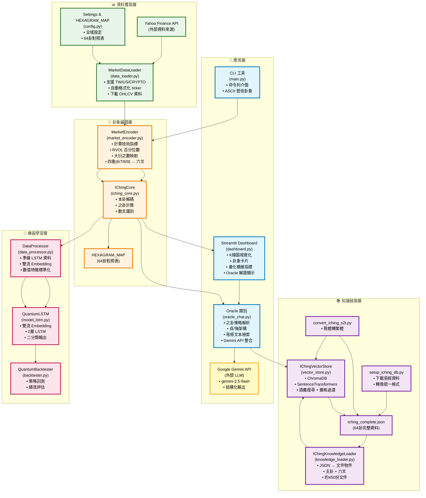
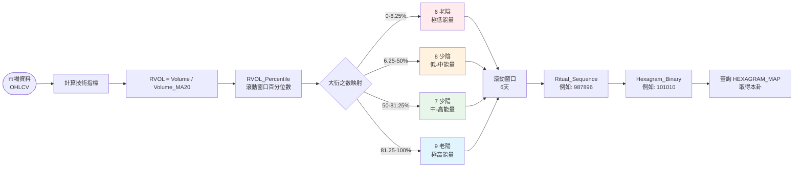

# Quantum I-Ching 系統架構圖

## 完整系統架構（類似 RAG 架構圖風格）



---

## 詳細資料流程圖

### 主要流程：使用者查詢 → Oracle 解讀

```mermaid
flowchart TB
    subgraph Phase1["📊 階段一：資料獲取"]
        direction TB
        User[👤 使用者<br/>輸入股票代號/問題]
        DL[MarketDataLoader<br/>fetch_data]
        Format[格式化 ticker<br/>2330 → 2330.TW]
        RawData[raw_df<br/>OHLCV 原始資料]
        
        User --> DL
        DL --> Format
        Format --> RawData
    end

    subgraph Phase2["🔢 階段二：卦象編碼"]
        direction TB
        ME[MarketEncoder<br/>generate_hexagrams]
        CalcTech[計算技術指標<br/>RVOL, RVOL_Percentile]
        DayanMap[大衍之數映射<br/>RVOL → 6/7/8/9]
        Rolling[滾動窗口 6天<br/>Ritual_Sequence]
        IC1[IChingCore<br/>計算本卦/之卦]
        EncodedData[encoded_df<br/>含 Ritual_Sequence]
        
        CalcTech --> DayanMap
        DayanMap --> Rolling
        Rolling --> IC1
        IC1 --> EncodedData
        ME --> CalcTech
    end

    subgraph Phase3["🔮 階段三：卦象解讀"]
        direction TB
        IC2[IChingCore<br/>interpret_sequence]
        HexInfo[取得卦象資訊<br/>current_hex, future_hex, moving_lines]
        MarketState[組成 current_market_state]
        Visualize[視覺化處理<br/>K 線圖、卦象卡片]
        
        IC2 --> HexInfo
        HexInfo --> MarketState
        MarketState --> Visualize
    end

    subgraph Phase4["🔮 階段四：Oracle 解讀"]
        direction TB
        Oracle[Oracle 類別<br/>ask]
        Strategy[解析之卦策略<br/>依動爻數量決定]
        JSON[iching_complete.json<br/>64卦完整資料]
        Extract[抽取易經經文<br/>hex_id + line_number]
        IChingText[取得經文<br/>本卦＋之卦＋動爻]
        Prompt[建立系統提示<br/>含貞/悔框架]
        Gemini[Google Gemini API<br/>generate_content]
        Response[結構化回答<br/>Markdown]
        
        Strategy --> Extract
        Extract --> JSON
        JSON --> IChingText
        IChingText --> Prompt
        Prompt --> Gemini
        Gemini --> Response
        Oracle --> Strategy
    end

    subgraph Phase5["📱 階段五：結果顯示"]
        Result[顯示最終結果<br/>K 線圖 + 卦象 + 解讀]
    end

    %% 主要資料流程
    RawData --> ME
    EncodedData --> IC2
    Visualize --> Oracle
    Response --> Result

    %% 樣式
    classDef phase1 fill:#e8f5e9,stroke:#2e7d32,stroke-width:3px,color:#000
    classDef phase2 fill:#fff3e0,stroke:#f57c00,stroke-width:3px,color:#000
    classDef phase3 fill:#f3e5f5,stroke:#7b1fa2,stroke-width:3px,color:#000
    classDef phase4 fill:#fce4ec,stroke:#c2185b,stroke-width:3px,color:#000
    classDef phase5 fill:#e1f5fe,stroke:#0277bd,stroke-width:3px,color:#000
    classDef external fill:#fff9c4,stroke:#f9a825,stroke-width:3px,color:#000

    class User,DL,Format,RawData phase1
    class ME,CalcTech,DayanMap,Rolling,IC1,EncodedData phase2
    class IC2,HexInfo,MarketState,Visualize phase3
    class Oracle,Strategy,Extract,IChingText,Prompt,Response phase4
    class Result phase5
    class JSON,Gemini external
```



---

## 之卦策略決策樹

```mermaid
flowchart TD
    Start([開始: 獲取 ritual_sequence]) --> Count{計算動爻數量<br/>(6 和 9 的數量)}
    
    Count -->|0 動爻| Strategy0[Total Acceptance<br/>查本卦卦辭/象辭]
    Count -->|1 動爻| Strategy1[Specific Focus<br/>查該動爻文本]
    Count -->|2 動爻| Strategy2[Primary vs Secondary<br/>下爻貞/上爻悔]
    Count -->|3 動爻| Strategy3[Hedging Moment<br/>本卦貞/之卦悔]
    Count -->|4-5 動爻| Strategy45[Trend Reversal<br/>之卦貞/本卦悔]
    Count -->|6 動爻| Check6{是否為乾/坤卦?}
    
    Check6 -->|乾卦| Strategy6Qian[Extreme Reversal<br/>用「用九」]
    Check6 -->|坤卦| Strategy6Kun[Extreme Reversal<br/>用「用六」]
    Check6 -->|其他| Strategy6Other[Extreme Reversal<br/>用之卦卦辭]
    
    Strategy0 --> Query[從 iching_complete.json<br/>抽取對應經文]
    Strategy1 --> Query
    Strategy2 --> Query
    Strategy3 --> Query
    Strategy45 --> Query
    Strategy6Qian --> Query
    Strategy6Kun --> Query
    Strategy6Other --> Query
    
    Query --> Prompt[構造系統提示<br/>含貞/悔框架]
    Prompt --> Gemini[Gemini API 生成回答]
    Gemini --> Output[返回結構化解讀]
    
    style Strategy0 fill:#e8f5e9
    style Strategy1 fill:#fff3e0
    style Strategy2 fill:#e1f5fe
    style Strategy3 fill:#f3e5f5
    style Strategy45 fill:#fce4ec
    style Strategy6Qian fill:#ffebee
    style Strategy6Kun fill:#ffebee
    style Strategy6Other fill:#ffebee
```

---

## 大衍之數映射流程



---

## 貞/悔架構說明

```mermaid
flowchart TB
    subgraph Framework["貞/悔架構 (Zhen/Hui Framework)"]
        direction LR
        Zhen[貞 (Zhen)<br/>• 主體<br/>• 支撐<br/>• 長期<br/>• 進場<br/>• 持有]
        Hui[悔 (Hui)<br/>• 客體<br/>• 阻力<br/>• 短期<br/>• 出場<br/>• 風險]
    end
    
    subgraph Mapping["金融映射"]
        direction LR
        ZhenMap[貞 → 趨勢支撐<br/>主要方向<br/>可倚賴的層級]
        HuiMap[悔 → 風險管理<br/>壓力位<br/>需警惕的層級]
    end
    
    subgraph Example["操作建議範例"]
        direction TB
        ZhenAdvice[貞：XX 以下視為支撐<br/>可持有、逢回加碼]
        HuiAdvice[悔：YY 以上注意風險<br/>考慮減碼、嚴格止損]
    end
    
    Framework --> Mapping
    Mapping --> Example
    
    style Zhen fill:#e8f5e9
    style Hui fill:#ffebee
    style ZhenMap fill:#e8f5e9
    style HuiMap fill:#ffebee
```

---

## 模組功能對照表

| 模組 | 檔案 | 主要類別/函數 | 核心功能 |
|------|------|--------------|----------|
| **資料獲取** | `data_loader.py` | `MarketDataLoader` | 從 Yahoo Finance 獲取 OHLCV 資料，支援多市場 |
| **卦象編碼** | `market_encoder.py` | `MarketEncoder` | 價格/成交量 → 四象(6/7/8/9) → 六爻卦象 |
| **卦象解碼** | `iching_core.py` | `IChingCore` | 本卦/之卦/動爻計算與查詢 |
| **設定檔** | `config.py` | `Settings`, `HEXAGRAM_MAP` | 全域設定與64卦對照表 |
| **知識載入** | `knowledge_loader.py` | `IChingKnowledgeLoader` | JSON → 文件物件（主卦+六爻） |
| **向量資料庫** | `vector_store.py` | `IChingVectorStore` | ChromaDB 語義搜尋與嚴格過濾 |
| **神諭核心** | `oracle_chat.py` | `Oracle` | 整合所有模組，之卦策略，Gemini API |
| **Web 介面** | `dashboard.py` | - | Streamlit 儀表板，K線圖，卦象視覺化 |
| **CLI 工具** | `main.py` | `main()` | 命令列介面，ASCII 藝術卦象 |
| **資料處理** | `data_processor.py` | `DataProcessor` | 準備 LSTM 訓練資料（雙流架構） |
| **LSTM 模型** | `model_lstm.py` | `QuantumLSTM` | 雙流 Embedding LSTM 模型 |
| **回測引擎** | `backtester.py` | `QuantumBacktester` | 策略回測與績效評估 |

---

## 技術棧總覽

```
資料獲取層:
  ├─ yfinance (Yahoo Finance API)
  ├─ pandas (資料處理)
  └─ numpy (數值計算)

卦象編碼層:
  ├─ 大衍之數機率分布 (傳統易經邏輯)
  ├─ 滾動窗口 (6天)
  └─ 二進制編碼 (64卦對照)

知識檢索層:
  ├─ ChromaDB (向量資料庫)
  ├─ SentenceTransformers (all-MiniLM-L6-v2)
  └─ JSON (iching_complete.json)

應用層:
  ├─ Streamlit (Web 介面)
  ├─ Plotly (K線圖視覺化)
  └─ Google Gemini API (LLM生成)

機器學習層 (可選):
  ├─ PyTorch (LSTM 模型)
  ├─ XGBoost (波動性預測)
  └─ sklearn (資料標準化)
```

---

## 關鍵設計原則

1. **Calculate Once, Use Everywhere**
   - Dashboard 計算卦象一次，傳給 Oracle 使用
   - 確保前後端卦象完全一致

2. **嚴格對應易經原文**
   - 直接從 JSON 依 hex_id + line_number 抽取
   - 不依賴語義搜尋決定卦象
   - 確保 100% 準確性

3. **系統化之卦策略**
   - 依動爻數量動態選擇查詢策略
   - 結合貞/悔架構提供結構化分析

4. **大衍之數機率分布**
   - 使用傳統易經機率分布
   - 符合易經傳統邏輯

5. **多市場統一介面**
   - 自動格式化 ticker
   - 使用者無需手動輸入後綴
