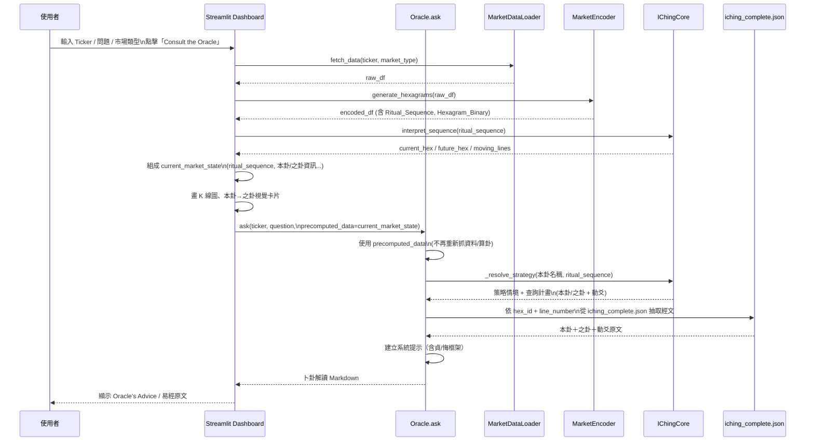

# Quantum I-Ching 股市卜卦系統

結合量化市場資料、易經六十四卦與 Google Gemini 的 **AI 金融卜卦系統**。  
專案目標是將股票價格結構轉換為卦象，並透過 RAG + LLM 產生「看盤＋卜卦」式的現代金融解讀。

> **重要聲明**：本專案所有內容僅供研究與教育參考，  
> 不構成任何投資建議、買賣邀約或報酬保證，實際投資決策請自行審慎評估風險。

---

## 功能總覽

- **資料層 (Phase 1 & 3)**
  - `data_loader.py`：從 Yahoo Finance 下載歷史股價（支援美股 / 台股 / 加密貨幣）。
  - `market_encoder.py`：將價格與成交量轉成四象（6/7/8/9），再組成六爻卦象，並生成**主卦 ID**、**變卦（之卦）ID** 和**動爻數量**。
  - `iching_core.py`：由「儀式數字序列」解碼出當前卦／未來卦與動爻。
  - `data_processor.py`：將含卦象的時間序列轉換為 LSTM 可用的訓練資料（**雙流架構**：主卦 + 變卦 + 動爻數量）。
  - `model_lstm.py` + `backtester.py`：**雙流 Embedding LSTM** 模型與簡易回測框架。
  - `reset_data.py`：資料重置工具，清除舊快取並強制重新生成包含新欄位的資料。

- **知識庫與 RAG (Phase 2)**
  - `config.py` + `HEXAGRAM_MAP`：完整 64 卦對照表（ID、英文名、繁中卦名）。
  - `setup_iching_db.py`：從 [john-walks-slow/open-iching](https://github.com/john-walks-slow/open-iching) 下載完整易經資料（64 卦含六爻），轉為統一格式並儲存至 `data/iching_complete.json`。
  - `convert_iching_s2t.py`：將 `iching_complete.json` 內簡體中文轉為繁體，並重建 ChromaDB 向量庫。
  - `knowledge_loader.py`：將 JSON 轉成可嵌入文件物件（主卦 + 六爻，共約 450 份文件）。
  - `vector_store.py`：使用 ChromaDB + SentenceTransformers 建立本地向量資料庫。
  - `oracle_chat.py` (`Oracle` 類別)：
    - 實作傳統「之卦 (Zhi Gua)」策略：依動爻數量（0-6）動態選擇查詢策略。
    - 引入 **貞 (Zhen) / 悔 (Hui)** 架構：貞=主體/支撐/長期/進場，悔=客體/阻力/短期/出場。
    - 讀取市場資料 → 生成卦象 → 依策略查詢易經文本 → 呼叫 Gemini。
    - 輸出結構化、繁體中文的投資解讀（Executive Summary / 易經原文 / 現代解讀 / 操作建議）。

- **前端介面 (Phase 4)**
  - `dashboard.py`：Streamlit Web 儀表板（專業金融終端風格）：
    - **左側側邊欄**：輸入股票代號（支援台股純數字，例如 `2330`）、市場類型選擇（TW/US/CRYPTO）。
    - **中間主區域**：
      * 最近 60 日 K 線圖（Plotly 主題，淺灰/白色交替背景，Y 軸深灰色網格線）
      * 波動率爆發機率 Gauge Chart（響應式設計，自動適應螢幕大小）
    - **右側卦象卡片**：
      * **無動爻**：顯示單一本卦（六爻、陽實線／陰斷線）。
      * **有動爻**：並排顯示本卦 → 之卦，動爻以橙色邊框高亮標示，底部顯示動爻說明。
      * **情緒儀表**：自訂 HTML/CSS 進度條，顯示多方能量（陽爻比例），紅色（>50%）表示多方，綠色（≤50%）表示空方。
    - **量化橋接指標列**（圖表與解讀之間）：
      * 收盤價（含漲跌幅）
      * RVOL（相對成交量，tooltip 說明）
      * 系統狀態（依動爻數量：Stable/Active/Volatile，tooltip 說明）
      * 趨勢強度（Bullish 🐂 / Bearish 🐻，tooltip 說明）
    - **Oracle 解讀區塊**（帶邊框容器）：
      * 🚀 投資快訊（永遠顯示）
      * 🎯 關鍵操作建議（永遠顯示，依語氣自動選擇色彩：success/error/info）
      * 📜 易經原文（可摺疊）
      * 💡 現代解讀（可摺疊）
    - **AI 小幫手追問系統**：
      * 在 Oracle's Advice 下方獨立區塊
      * 支援針對已生成的建議進行追問與討論
      * 使用 Google Gemini 提供即時回應
      * 顯示完整的問答討論串
    - **深色模式支援**：
      * 自動偵測使用者系統主題
      * 提供高對比度顏色，確保文字清晰可讀
      * 圖表自動調整為適合的顏色方案

詳細技術設計與歷次修正，請見 `DEV_LOG.md`。

---

## 安裝與環境設定

### 1. 建立虛擬環境（建議）

```bash
cd "I-Ching AI"
python -m venv venv
venv\Scripts\activate  # Windows
```

### 2. 安裝依賴套件

```bash
pip install -r requirements.txt
```

### 3. 設定環境變數（Google Gemini）

在專案根目錄建立 `.env` 檔案（或使用系統環境變數）：

```env
GOOGLE_API_KEY=your_gemini_api_key_here
```

### 4. 初始化易經知識庫

首次使用前，需要下載並建立易經向量資料庫：

```bash
# 步驟 1: 下載易經資料（從 john-walks-slow/open-iching）
python setup_iching_db.py

# 步驟 2: 簡體轉繁體並重建向量庫（約 450 份文件：64 主卦 + 386 爻）
python convert_iching_s2t.py
```

**說明**：
- `setup_iching_db.py` 會從 jsDelivr CDN 下載 open-iching 的 `iching/iching.json`，驗證後轉為統一格式儲存。
- `convert_iching_s2t.py` 使用 OpenCC 將簡體轉為繁體，並重建 ChromaDB 向量庫（若未安裝 `opencc-python-reimplemented` 會自動安裝）。
- 之後執行 `oracle_chat.py` 或 `dashboard.py` 時，向量庫會自動載入。

---

## 市場設定與台股支援

在 `config.py` 中：

```python
settings = Settings(
    # ...
    MARKET_TYPE="TW",  # 'US', 'TW', 'CRYPTO'
)
```

- **台股 (`MARKET_TYPE="TW"`)**
  - `MarketDataLoader` 會自動將 ticker 補成 `2330.TW`、`2317.TW` 等格式。
  - Streamlit 預設輸入欄可直接輸入 **純數字代碼**：`2330`、`2317`……
  - 前端會自動補 `.TW` 作為實際查詢用代碼。

- **美股 (`MARKET_TYPE="US"`)**
  - 直接使用原始代碼，例如：`NVDA`、`AAPL`。

- **加密貨幣 (`MARKET_TYPE="CRYPTO"`)**
  - 自動補 `-USD`，例如輸入 `BTC` 會查詢 `BTC-USD`。

---

## 執行神諭後端 (CLI)

單純測試 `Oracle` 的問答能力，可以直接執行：

```bash
python oracle_chat.py
```

程式會：

- 初始化 `Oracle`（載入 ChromaDB、SentenceTransformers、Gemini 模型）。
- 以預設示範（例如 `NVDA`, "Should I buy now?"）產生完整卜卦解讀，輸出至終端機。

---

## 執行 Streamlit 儀表板 (`dashboard.py`)

### 啟動方式

```bash
streamlit run dashboard.py
```

啟動後瀏覽器會自動打開（預設 `http://localhost:8501`）：

1. 在左側輸入：
   - 市場類型（TW / US / CRYPTO）。
   - 股票代碼（台股例如 `2330` 或 `2330.TW`，美股例如 `NVDA`，加密貨幣例如 `BTC`）。
   - 問題文字（中英皆可，如「我現在該買嗎？」）。
2. 按下 `Consult the Oracle (卜卦)`。
3. 會看到：
   - 中間：最近 60 日 K 線圖，標題會顯示「代碼（公司名稱）＋卦名」，圖上疊加 MA20（黃色）與 MA60（紫色）移動平均線。
   - 圖表下方：**量化橋接指標列**（四欄）：
     * 收盤價（含漲跌幅）
     * RVOL（相對成交量，懸停查看說明）
     * 系統狀態（Stable/Active/Volatile，懸停查看說明）
     * 趨勢強度（Bullish 🐂 / Bearish 🐻，懸停查看說明）
   - 右側：
     * **無動爻**：單一卦象顯示（六爻、陽實線／陰斷線）與卦名／卦號。
     * **有動爻**：本卦 → 之卦並排顯示，動爻以橙色邊框高亮標示，底部顯示動爻說明（如「動爻：初爻、三爻 (2 個)」）。
     * **情緒儀表**：自訂進度條顯示多方能量（陽爻比例），紅色（>50%）表示多方，綠色（≤50%）表示空方。
   - 下方：**Oracle's Advice / 卜卦解讀**（帶邊框容器）：
     * 🚀 投資快訊（永遠顯示）
     * 🎯 關鍵操作建議（永遠顯示，依語氣自動選擇色彩：綠色=買進、紅色=風險、藍色=中性）
     * 📜 易經原文（可摺疊，點擊展開）
     * 💡 現代解讀（可摺疊，點擊展開）

---

## 程式架構與資料流程

### 元件架構（高階）

```mermaid
flowchart LR
    subgraph Frontend[Streamlit Dashboard]
        UI[使用者輸入 Ticker / 問題 / 市場類型]
        Chart[K 線圖視覺化]
        HexView[本卦 → 之卦 視覺卡片]
        AdviceView[Oracle's Advice / 卜卦解讀]
    end

    subgraph Backend[Python Backend]
        DL[MarketDataLoader\n(yfinance)]
        ME[MarketEncoder\n(價格→四象→六爻)]
        Core[IChingCore\n(本卦/之卦/動爻)]
        Oracle[Oracle\n(之卦策略 + 貞/悔 + Gemini)]
        VS[IChingVectorStore\n(ChromaDB)]
        KL[IChingKnowledgeLoader\n(iching_complete.json)]
    end

    UI -->|提交 Ticker/問題| DL
    DL --> ME --> Core -->|ritual_sequence, hex_id, 本卦/之卦| UI
    DL -->|raw_df| Chart
    UI -->|precomputed_data\n(單一市場狀態)| Oracle
    Oracle --> VS
    VS --> KL
    Oracle --> AdviceView
    Core --> HexView
```

### Dashboard ↔ Oracle 單一來源流程



---

## 檔案導覽 (簡版)

- `config.py`：全域設定（日期、目標股票清單、MARKET_TYPE、HEXAGRAM_MAP）。
- `data_loader.py`：抓取 Yahoo Finance 歷史資料，支援 TW / US / CRYPTO。
- `market_encoder.py`：Whale Volume 四象邏輯 + 六爻卦象生成。
- `iching_core.py`：當前卦／未來卦／動爻計算與卦名查詢。
- `setup_iching_db.py`：下載 open-iching 易經資料並轉為統一格式。
- `convert_iching_s2t.py`：簡體轉繁體並重建向量庫。
- `knowledge_loader.py`：載入 `data/iching_complete.json` 為 RAG 文件（主卦 + 六爻）。
- `vector_store.py`：Chroma 向量資料庫（語義檢索易經文本）。
- `oracle_chat.py`：Quantum I-Ching 神諭（整合市場資料、卦象、RAG、Gemini），實作之卦策略與貞／悔架構，並支援 Dashboard 傳入單一市場狀態（precomputed_data）避免重複算卦。
- `dashboard.py`：Streamlit 前端儀表板（台股優先、K 線＋卦象＋解讀；本卦／之卦與卜卦解讀共用同一份 current_market_state）。
- `model_lstm.py`：LSTM 模型與訓練流程（**雙流 Embedding 架構**）。
- `backtester.py`：策略回測引擎。
- `reset_data.py`：資料重置工具（清除舊快取，強制重新生成資料）。
- `DEV_LOG.md`：完整開發日誌與除錯紀錄（推薦先閱讀）。

---

## 注意事項與建議

- **API 成本與頻率**
  - Gemini 呼叫會產生費用，建議開發／測試時控制詢問次數。
  - Yahoo Finance 資料抓取頻繁時可能觸發速率限制，可適度快取本地資料。

- **法律與風險**
  - 本專案僅供學術與技術研究之用。
  - 任何基於本系統產生之內容進行的交易或投資行為，風險自負。

---

## 核心功能：之卦 (Zhi Gua) 策略

`Oracle` 類別實作傳統易經「之卦」解法，依動爻（6、9）數量動態選擇查詢策略：

- **0 動爻**：Total Acceptance，查本卦卦辭／象辭。
- **1 動爻**：Specific Focus，僅查該動爻文本（如「乾卦 初九」）。
- **2 動爻**：Primary vs Secondary，下爻為貞（進場／支撐）、上爻為悔（出場／阻力）。
- **3 動爻**：Hedging Moment，本卦為貞（持有）、之卦為悔（風險）。
- **4 或 5 動爻**：Trend Reversal，之卦為貞（主趨勢）、本卦為悔（歷史）。
- **6 動爻**：Extreme Reversal，乾卦用「用九」、坤卦用「用六」，其餘用之卦卦辭。

系統會依策略自動查詢對應的易經文本，並在 Gemini 提示中注入 **貞 (Zhen) / 悔 (Hui)** 架構，產出具主客、支撐／阻力、進出場意涵的金融建議。

---

---

## 機器學習架構：雙流 Embedding LSTM

### 架構概述

本專案使用 **雙流 Embedding LSTM** 架構，結合：
1. **主卦（本卦）Embedding**：代表當前市場狀態
2. **變卦（之卦）Embedding**：代表未來變動方向
3. **數值特徵**：技術指標（Close, Volume, RVOL, Daily_Return） + **動爻數量**（Num_Moving_Lines，0-6）

### 架構設計

```
輸入層：
  - 數值特徵 (5 維): [Close, Volume, RVOL, Daily_Return, Num_Moving_Lines]
  - 主卦 ID (0-63) → Embedding (8 維)
  - 變卦 ID (0-63) → Embedding (8 維)

特徵融合：
  [數值特徵(5) + 主卦嵌入(8) + 變卦嵌入(8)] → 總計 21 維

LSTM 層：
  - 2 層 LSTM，隱藏維度 64
  - Dropout 0.2

輸出層：
  - 全連接層 → Sigmoid → 二分類機率（上漲/下跌）
```

### 關鍵設計決策

- **雙流 Embedding（不平均）**：
  - 主卦和變卦的嵌入**拼接**而非平均
  - 保留「當前 vs. 未來」的對比結構資訊
  - 符合易經「本卦 → 之卦」的變動邏輯

- **動爻數量作為數值特徵**：
  - 動爻數量（0-6）代表市場「能量」或「波動性」
  - 作為連續變數標準化，與其他技術指標一起輸入
  - 提供額外的結構化資訊

### 資料流程

1. **資料生成** (`market_encoder.py`)：
   - 從市場資料生成 `Ritual_Sequence`（儀式數字序列）
   - 計算主卦 `Hexagram_Binary` → `Main_Hex_ID`
   - 計算變卦 `Future_Binary` → `Future_Hex_ID`
   - 統計動爻數量 `Num_Moving_Lines`（6 和 9 的數量）

2. **資料處理** (`data_processor.py`)：
   - 提取數值特徵（包含 `Num_Moving_Lines`）
   - 標準化數值特徵
   - 生成時間序列（滑動窗口，預設 10 天）
   - 返回四元組：`(X_num, X_main_hex, X_future_hex, y)`

3. **模型訓練** (`model_lstm.py`)：
   - 雙流 Embedding 層分別處理主卦和變卦
   - LSTM 學習時間序列模式
   - 二分類輸出（上漲/下跌機率）

### 模型升級注意事項

⚠️ **破壞性變更**：舊模型權重（`data/best_model.pth`）與新架構不兼容。

**升級步驟**：
1. 執行 `python reset_data.py` 清除舊快取和模型
2. 執行 `python model_lstm.py` 重新訓練模型
3. 執行 `python backtester.py` 進行回測

---  
未來如要擴充新的前端（例如 FastAPI / React），建議沿用 `Oracle` 作為單一後端入口。 

